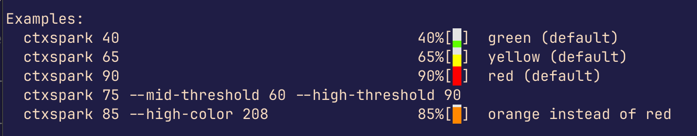

# ctxspark

A minimal Rust CLI that outputs a color-coded ctxspark character for a context usage percentage (0–99). Designed for use in terminal status lines (e.g. Claude Code, tmux, shell prompts).



## Default color thresholds

| Range    | Color        | ANSI 256 |
|----------|--------------|----------|
| 0–50%    | Green        | 82       |
| 51–80%   | Yellow       | 226      |
| 81–99%   | Red          | 196      |
| Background | Light grey | 254      |

## Usage

```
ctxspark [OPTIONS] <VALUE>

Arguments:
  <VALUE>  Context usage percentage (0-99)

Options:
      --low-color <COLOR>       ANSI 256 color for low usage (0-mid_threshold) [default: 82]
      --mid-color <COLOR>       ANSI 256 color for mid usage (mid_threshold-high_threshold) [default: 226]
      --high-color <COLOR>      ANSI 256 color for high usage (above high_threshold) [default: 196]
      --mid-threshold <PCT>     Percentage threshold between low and mid color [default: 50]
      --high-threshold <PCT>    Percentage threshold between mid and high color [default: 80]
      --bg-color <COLOR>        ANSI 256 background color [default: 254]
  -h, --help                    Print help
  -V, --version                 Print version
```

## Examples

```bash
# Default colors
ctxspark 40    # 40%[▃]  green
ctxspark 65    # 65%[▅]  yellow
ctxspark 90    # 90%[█]  red

# Custom thresholds
ctxspark 75 --mid-threshold 60 --high-threshold 90

# Custom colors (ANSI 256)
ctxspark 85 --high-color 208   # orange instead of red
```

## Build

```bash
cargo build --release
# binary at: target/release/ctxspark
```

## Install

```bash
cargo install --path .
```
